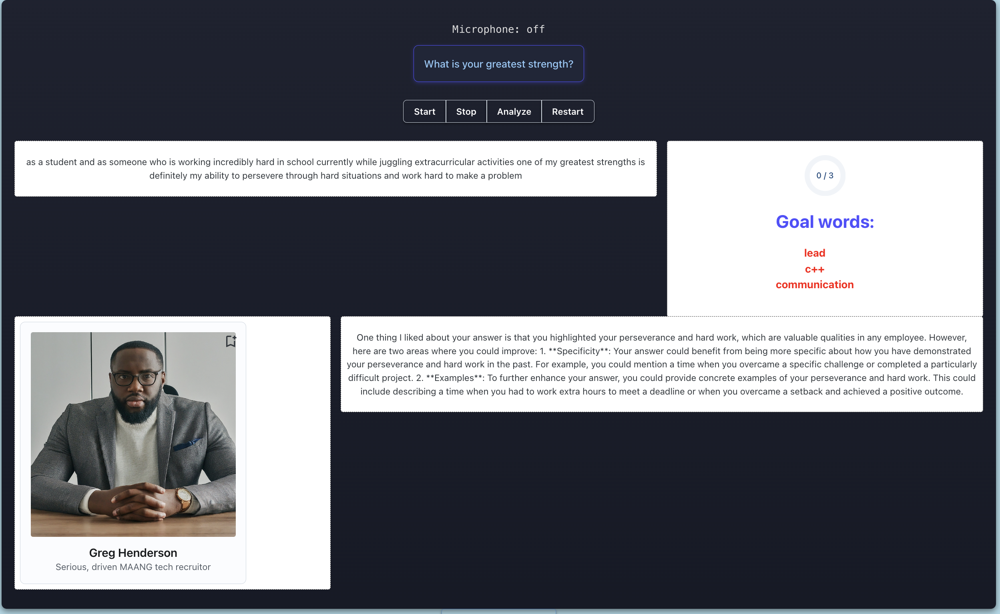

# AI Assisted Interview Prep Utilizing Gemini API

This project uses LLMs and voice recognition to gamify the interview prep process. 

Though this is only the MVP, users will be able to input key words they would like to say ("lead", "innovate", or even "Python") and experiences they'd like to mention ("Google", "Team Lead", "President") and the platform will recognize this and reward the user whether that be with engaging graphics or points. 

Further iterations will also enable users to choose the voice and response type of their AI interviewer and even complete coding assessments with a live AI interviewer probing for questions and helping them debug. 

